# COMPREHENSIVE REQUIREMENTS ANALYSIS, ARCHITECTURE & IMPLEMENTATION PLAN

## AGSVA Baseline Security Clearance Application Platform
### Fortune 500 Executive-Grade Information System

**Project Codename:** AGSVA Clearance Accelerator  
**Target Applicant:** Vikram Deshpande  
**Target Role:** Australian Taxation Office (ATO) - Baseline Security Clearance Required  
**Platform Classification:** C-Suite Executive Information Presentation Standards  
**Document Version:** 1.0  
**Date:** March 12, 2026  

---

## Enhancement Summary

**Deepened on:** March 12, 2026  
**Plan file:** `requirements.md`  
**Sections enhanced:** 12  
**Skill lenses applied:** `repo-research-analyst`, `spec-flow-analyzer`, `best-practices-researcher`, `framework-docs-researcher`, `performance-oracle`, `frontend-design`, `security-best-practices`, `security-sentinel`  
**Institutional learnings found:** None in `docs/solutions/`, `.codex/docs/`, or `~/.codex/docs/`

### Key Improvements

1. Grounded the plan in current AGSVA guidance for Baseline clearances, referee handling, and applicant timing expectations.
2. Added architecture guardrails for a browser-only deployment, including storage quotas, HTTPS requirements, and realistic limits without a backend.
3. Upgraded the quality bar with current security, accessibility, and Core Web Vitals guidance suited to a production-grade executive platform.

### Section Manifest

- `1.2 AGSVA Baseline Clearance Information Requirements` - official clearance, referee, and timing constraints
- `2.1 High-Level Architecture Overview` - browser-only architecture caveats and deployment prerequisites
- `2.2 Technology Stack Specification` - dependency rationalization and governance controls
- `2.3.2 Requirements Tracker` - data-visualization, accessibility, and business-day handling guidance
- `2.3.3 Document Management System` - storage quota, persistence, and encryption reality checks
- `2.3.4 Referee Management Portal` - AGSVA-aligned referee workflow and PDF packaging standards
- `3.4 Deployment Strategy` - secure-context, asset governance, and performance-budget guidance
- `4.1 Data Security Architecture` - CSP, Trusted Types, XSS, and client-side cryptography expectations
- `5.1 Testing Strategy` - accessibility, resilience, and browser-state failure-mode coverage
- `5.2 Quality Metrics` - Core Web Vitals and document workflow quality metrics
- `6.1 Primary User Flow` - missing exception-path and recovery-path handling
- `7.1 Application Success Indicators` and `8.2 Future Enhancement Roadmap` - controllable success measures and roadmap sequencing realism

## EXECUTIVE SUMMARY

This document presents a complete architectural blueprint for an enterprise-grade web application designed to improve the quality, completeness, and defensibility of an AGSVA Baseline Security Clearance application. The platform integrates disciplined readiness tracking, local-first information management, and controlled referee preparation while maintaining Fortune 500 C-suite presentation standards.

### Strategic Objectives

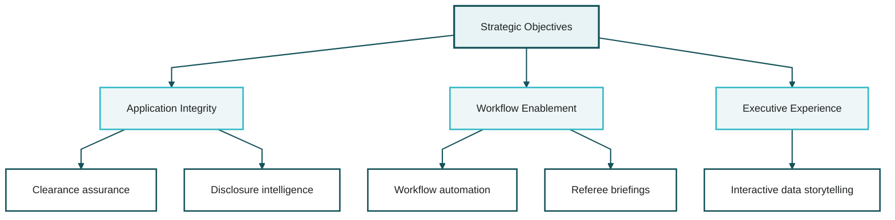

### Critical Success Factors

The platform addresses the applicant's specific situation: a highly qualified technical professional with unblemished 20-year career history, currently navigating traffic-related legal proceedings that require strategic disclosure management for security clearance purposes. The system must demonstrate integrity, transparency, and professional excellence while contextualizing the legal matter appropriately.

---

## PART I: COMPREHENSIVE REQUIREMENTS ANALYSIS

### 1.1 Functional Requirements Matrix

| ID | Requirement Description | Priority |
| --- | --- | --- |
| FR-001 | Interactive AGSVA Baseline clearance requirements dashboard | Critical |
| FR-002 | Document upload, validation, and management system | Critical |
| FR-003 | 5-year employment history tracker with verification | Critical |
| FR-004 | 5-year address history documentation system | Critical |
| FR-005 | Referee nomination and management portal | Critical |
| FR-006 | Automated referee briefing PDF generation (C-suite quality) | Critical |
| FR-007 | Legal proceedings disclosure strategy advisor | Critical |
| FR-008 | Financial information aggregation dashboard | High |
| FR-009 | Identity document verification checklist | High |
| FR-010 | Application completeness progress tracker | High |
| FR-011 | Timeline visualization (20-business-day countdown) | High |
| FR-012 | Partner and immediate family details form | Medium |
| FR-013 | Security clearance history tracker | Medium |
| FR-014 | Export complete application package (PDF/DOCX) | Medium |

*Functional Requirements Hierarchy*

#### 1.1.1 Traceability and Scope Governance

- Every functional requirement listed above must map to a concrete workflow, data model, validation rule, recovery state, and acceptance criterion in the implementation plan.
- `FR-008`, `FR-012`, and `FR-013` remain roadmap-tracked unless detailed field definitions and validation rules are approved. They are not authorized for ad hoc implementation.
- `FR-014` is limited in the browser-only release to local export artifacts controlled by the applicant. No online submission, server-side dispatch, or agency-side integration is implied.

### 1.2 AGSVA Baseline Clearance Information Requirements

Based on official AGSVA guidelines and the applicant's specific profile, the following information categories must be systematically collected and presented[14][20]:

#### 1.2.1 Eligibility Prerequisites

**Australian Citizenship**
- Full birth certificate (born in Australia) with minimum one parent's details
- Proof of Australian citizenship (passport, citizenship certificate)
- Photo ID linkage (selfie with current photo identification)

**Checkable Background Requirements**
- Demonstrated 5-year continuous verifiable history
- Address history (5 years, full addresses with dates)
- Employment history (5 years, employer details, positions, dates, addresses)
- Education history (5 years, institutions, qualifications, years attended)

**Timeline Data Rules**
- Date coverage must be validated across the most recent 5 years using a single canonical chronology model.
- Employment, address, education, travel, unemployment, and other explanatory states must be represented without silent gaps.
- Overlaps must be allowed only where they reflect real concurrent states and must be labeled explicitly.
- The platform must track coverage month-by-month for readiness and surface unresolved gaps as blocking issues before export.

#### 1.2.2 Personal Document Checklist

| Document Type | Specifications | Mandatory |
| --- | --- | --- |
| Birth Certificate | Full certificate with parent details | Yes |
| Australian Citizenship Proof | Passport/Certificate | Yes |
| Current Photo ID | Driver's license with clear photo | Yes |
| Photo ID Linkage | Selfie holding current photo ID | Yes |
| Secondary ID | Medicare card or ADF ID | Yes |
| Credit/Bank Card | Issued by financial institution | Yes |
| Proof of Current Address | License, utility bill, rates notice | Yes |
| Proof of Previous Address | One previous address documentation | Yes |
| Current Employment Proof | Pay slips, payment summary, letter | Yes |
| Previous Employment Proof | Documentation for one previous role | Yes |
| Current Marriage Certificate | If applicable - Registrar issued | Conditional |
| Divorce Certificates | All previous divorces - decree absolute | Conditional |
| Change of Name Certificate | Legal name change/deed poll | Conditional |

*Baseline Clearance Document Requirements*

#### 1.2.3 Referee Requirements (Critical Component)

For Baseline clearance, AGSVA requires[19][20]:

**Minimum Requirement:** 1 professional referee (supervisor) covering at least 3 months

**Referee Eligibility Criteria:**

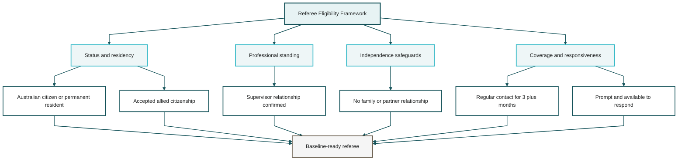

**Referee Information Required:**
- Full name
- Citizenship status
- Dates of supervision (minimum 3 months)
- Nature of association (supervisor/professional relationship)
- Complete contact details (phone and/or email based on the referee's preferred channel)
- Confirmation that the referee is aware of the nomination and willing to be contacted

**Minimization Rule:** The referee briefing workflow must not collect or expose third-party information that is unnecessary for local readiness tracking or manual briefing-pack generation. Referee residential address data belongs in the final formal application only if the sponsoring workflow explicitly requires it.

#### 1.2.4 Strategic Disclosure Support: Traffic Legal Proceedings

This section requires factual drafting assistance rather than legal advocacy. The platform must help the applicant produce a truthful, evidence-indexed summary that can be reviewed before use.

**Legal Proceedings Declaration Approach:**

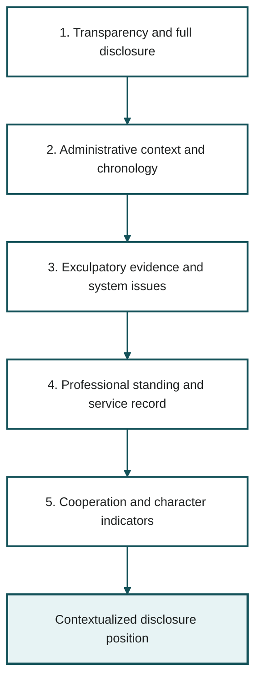

**Working Disclosure Template:**

*"The applicant is currently engaged in legal proceedings concerning traffic-related charges arising from vehicle intercepts conducted between 2025 and 2026. The matter is being contested. The applicant's position relies on documented chronology, licence-status material, and other supporting evidence that can be provided if requested. The applicant is cooperating with the legal process and is disclosing the matter to maintain accuracy and transparency."*

**Key Drafting Principles:**
- Honesty and transparency demonstrate trustworthiness (core AGSVA assessment criterion)[14]
- Context should prevent mischaracterization without drifting into unsupported advocacy
- Supporting material should be referenced as an evidence index, not embedded as argumentative narrative
- The feature must present a non-legal-advice boundary and require applicant review before export

#### 1.2.5 Research Insights

**Official AGSVA Operating Constraints:**
- Baseline clearance should be described consistently as access to `OFFICIAL` and/or `PROTECTED` resources unless the sponsoring agency states a narrower or broader handling model.
- AGSVA instructs applicants to complete the application within 20 business days, so the platform should anchor milestone warnings to business-day checkpoints rather than open-ended completion pacing.
- AGSVA referee reports are normally completed online in one sitting, usually take about 15-45 minutes, and the unique report link remains valid for 15 business days.
- AGSVA identifies a current direct supervisor as the ideal referee. If the applicant has not worked during the previous 12 months, the workflow should surface a personal-referee fallback rather than burying it as an exception.

**Planning Implications:**
- Treat referee responsiveness as an early schedule risk because delayed referee action can stall the overall vetting process.
- Make "complete application" a hard readiness gate before any downstream processing-time assumptions are shown to the applicant.
- Present legal disclosure as a truthful summary plus an evidence index, not as advocacy copy alone.

**References:**
- AGSVA Security Clearance Definitions: <https://www.agsva.gov.au/applicants/security-clearance-definitions>
- AGSVA Referees: <https://www.agsva.gov.au/applicants/referees>
- AGSVA Clearance Processing Times: <https://www.agsva.gov.au/applicants/clearance-processing-times>
- AGSVA What to Expect Guide: <https://www.agsva.gov.au/sites/default/files/2024-08/agvsa_what_to_expect_guide_v3_0.pdf>

### 1.3 Non-Functional Requirements

| Category | Requirement |
| --- | --- |
| **Performance** | `LCP <= 2.5s`, `INP <= 200ms`, `CLS <= 0.1` at the 75th percentile on the supported browser/device matrix; business-critical inputs and saves must remain non-blocking |
| **Security** | HTTPS for deployed environments; restrictive CSP and Trusted Types where supported; no third-party tracking; no seeded applicant data in shipped assets; no server-side storage in the browser-only release |
| **Usability** | Progressive disclosure, keyboard-complete flows, mobile-responsive design, and WCAG 2.2 AA compliance with text equivalents for every chart and infographic |
| **Reliability** | IndexedDB-backed local persistence with export/import recovery flow; graceful degradation when secure-context, storage, or graphics APIs are unavailable; no silent data loss on quota pressure |
| **Scalability** | Local workspace must handle multi-document metadata, repeated exports, and progressive enhancement without exceeding defined bundle and memory budgets |
| **Visual Quality** | Measurable design-system tokens, self-hosted fonts, consistent spacing, and production-ready PDF layout rules rather than subjective aesthetic claims alone |

*Non-Functional Requirements Specification*

---

## PART II: SYSTEM ARCHITECTURE & TECHNOLOGY STACK

### 2.1 High-Level Architecture Overview

The platform employs a local-first client-side architecture that prioritizes privacy, explicit browser limitations, and deterministic recovery behavior. Browser-only release scope ends at local storage, local export, and manual dispatch preparation; any feature requiring authoritative delivery, centralized audit, analytics ingestion, or multi-device state must be treated as a separate backend-enabled program.

**AGSVA Clearance Platform - System Architecture**

*Architecture Diagram - Logical Layers*

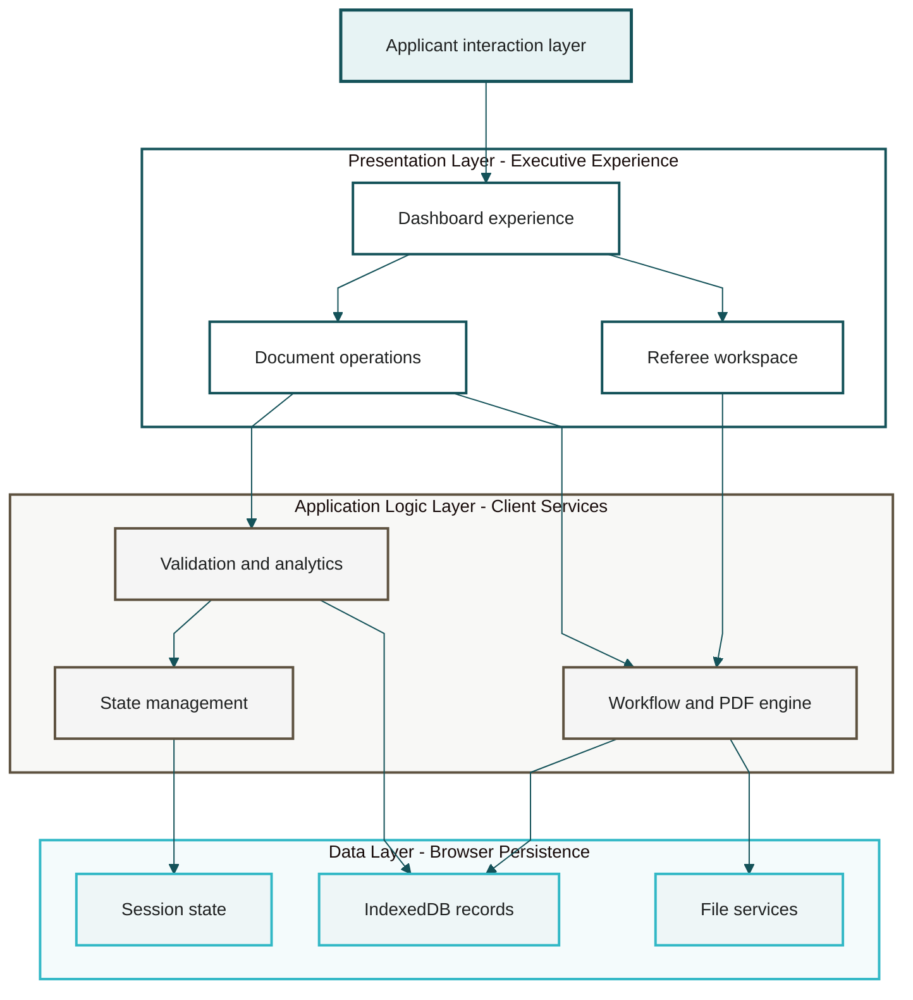

#### Research Insights

**Architecture Guardrails:**
- A browser-only architecture fits the privacy goal, but it cannot provide authoritative email dispatch, centralized audit trails, or multi-device synchronization without a backend. "Invitation dispatch" should therefore be scoped as local PDF generation plus applicant-driven sending until server-side infrastructure is approved.
- Service workers, persistent storage, and several resilience features only work in secure contexts, so HTTPS is a mandatory deployment requirement rather than a hosting preference.
- IndexedDB and related storage are best-effort by default. Quota pressure, eviction, and browser-specific persistence behavior need explicit recovery states in the architecture.
- The Three.js layer should be progressive enhancement. A 2D dashboard fallback is required for low-power devices, reduced-motion users, and browsers with WebGL constraints.

**References:**
- MDN Service Worker API: <https://developer.mozilla.org/en-US/docs/Web/API/Service_Worker_API>
- MDN IndexedDB Guide: <https://developer.mozilla.org/en-US/docs/Web/API/IndexedDB_API/Using_IndexedDB>
- MDN Storage Quotas and Eviction: <https://developer.mozilla.org/en-US/docs/Web/API/Storage_API/Storage_quotas_and_eviction_criteria>

### 2.2 Technology Stack Specification

#### 2.2.1 Core Technologies

**HTML5 Foundation**
- Semantic HTML5 structure
- Progressive web app (PWA) capabilities
- Offline functionality support
- Advanced form validation APIs

**CSS3 & Modern Styling**
- CSS Grid and Flexbox for sophisticated layouts
- CSS Custom Properties for dynamic theming
- CSS Animations and Transitions for smooth interactions
- Responsive design with mobile-first approach

**JavaScript ES6+ (Vanilla JS)**
- Modern JavaScript features (async/await, modules, destructuring)
- No framework dependencies for maximum performance
- Modular architecture for maintainability
- Service Workers for offline capabilities

#### 2.2.2 Specialized Libraries & Frameworks

| Library | Version | Purpose |
| --- | --- | --- |
| Three.js | r160+ | Optional progressive-enhancement 3D visuals only after 2D fallback parity is achieved |
| D3.js | v7+ | Accessible progress, timeline, and status visualizations with table/text equivalents |
| GSAP | v3.12+ | Controlled state-change animation where motion materially improves comprehension |
| jsPDF | v2.5+ | Deterministic local PDF generation for manual referee briefing packs |
| html2canvas | v1.4+ | Limited chart capture support where vector/text rendering is not feasible |

*Specialized JavaScript Libraries*

#### 2.2.3 High-Quality Reference Repositories

The following GitHub repositories represent Fortune 500-grade implementations and serve as architectural references:

**1. Three.js Enterprise Visualizations**
- Repository: `mrdoob/three.js` (Official)
- Examples: `/examples/webgl_interactive_cubes.html`, `/examples/webgl_postprocessing_unreal_bloom.html`
- Quality Standard: Advanced shader effects, professional lighting, smooth interactions

**2. D3.js Executive Dashboards**
- Repository: `d3/d3` (Official)
- Examples: Observable notebooks - "Executive Dashboard Templates"
- Quality Standard: Interactive charts, real-time data updates, professional color schemes

**3. GSAP Professional Animations**
- Repository: `greensock/GSAP` (Official)
- Examples: ScrollTrigger demos, morphing effects
- Quality Standard: Buttery-smooth 60fps animations, complex timeline orchestration

**4. Enterprise UI Components**
- Repository: `tailwindlabs/tailwindcss` (for reference patterns)
- Repository: `animate-css/animate.css` (animation patterns)
- Quality Standard: Professional micro-interactions, polished transitions

**5. PDF Generation Excellence**
- Repository: `parallax/jsPDF` (Official)
- Repository: `niklasvh/html2canvas` (Official)
- Quality Standard: High-resolution outputs, professional formatting

#### 2.2.4 Research Insights

**Dependency Governance:**
- Keep the dependency surface minimal. `GSAP` is the only approved motion library in the browser-only release; `Three.js` remains progressive enhancement and is not a baseline dependency for task completion.
- Pin exact library versions and prefer locally controlled static assets or an internal artifact source over live CDN drift, especially for a government-adjacent deployment.
- Feature-detect WebGL, canvas-heavy effects, and storage APIs so the platform can degrade gracefully instead of failing hard on constrained browsers.
- Define bundle and memory budgets up front. Optional visualization code must load only after baseline workflow controls are interactive and accessible.

**References:**
- Three.js Cleanup Manual: <https://github.com/mrdoob/three.js/blob/dev/manual/en/cleanup.html>
- jsPDF Repository and Examples: <https://github.com/parallax/jsPDF>

### 2.3 Detailed Component Architecture

#### 2.3.1 Dashboard Component (Three.js 3D Interactive Scene)

**Visual Concept:** Immersive 3D environment representing security clearance journey

**Technical Implementation:**
```js
// Three.js Scene Setup
const scene = new THREE.Scene();
const camera = new THREE.PerspectiveCamera(75, window.innerWidth/window.innerHeight, 0.1, 1000);
const renderer = new THREE.WebGLRenderer({ antialias: true, alpha: true });

// Interactive 3D Elements
const badge = new THREE.Mesh(
    new THREE.BoxGeometry(1, 1, 1),
    new THREE.MeshBasicMaterial({ color: 0x00ff00 })
);
scene.add(badge);

const particles = new THREE.Points(
    new THREE.BufferGeometry(),
    new THREE.PointsMaterial({ color: 0x0000ff, size: 0.1 })
);
scene.add(particles);

const waypoints = new THREE.Object3D();
scene.add(waypoints);
- Rotating security badge model (GLTF format)
- Particle system representing documentation progress
- Interactive waypoints for each clearance requirement
- Dynamic lighting responding to user progress
- Bloom effects for completed sections
```

**Key Features:**

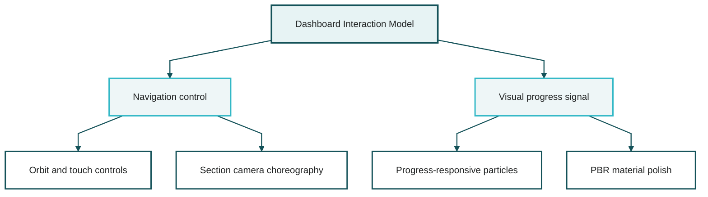

#### 2.3.2 Requirements Tracker (D3.js Interactive Infographic)

**Visual Concept:** Executive-grade progress dashboard with real-time status updates

**Data Visualization Components:**

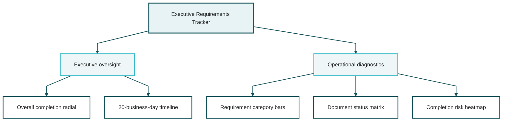

**Technical Implementation:**
```js
// D3.js Radial Progress Chart
const progressArc = d3.arc()
    .innerRadius(radius * 0.7)
    .outerRadius(radius)
    .startAngle(0)
    .endAngle(d => (d.completion / 100) * 2 * Math.PI);

// Animated transitions
svg.selectAll('.progress-arc')
    .transition()
    .duration(1000)
    .ease(d3.easeCubicOut)
    .attrTween('d', arcTween);
```

##### Research Insights

- Use stable keys and `selection.join(...)` patterns so frequent progress updates remain deterministic and do not leak SVG elements over time.
- Model the 20-day tracker as business days rather than calendar days; this section currently implies a schedule but does not define business-day logic.
- Every chart should ship with a text summary or table equivalent. Radial charts, heatmaps, and matrix views alone do not meet executive accessibility expectations.
- Use animation to emphasize state changes only. Continuous motion on critical status graphics reduces readability and distracts from completion risk.

**References:**
- WAI Complex Images Guidance: <https://www.w3.org/WAI/tutorials/images/complex/>
- WCAG 2.2: <https://www.w3.org/TR/WCAG22/>

#### 2.3.3 Document Management System

**Architecture Pattern:** File API + IndexedDB + Client-Side Validation

**Features:**

```mermaid
%%{init: {'theme': 'base', 'themeVariables': { 'background': '#FCFCF9', 'primaryColor': '#FFFFFF', 'primaryTextColor': '#1F2121', 'primaryBorderColor': '#145259', 'lineColor': '#145259', 'secondaryColor': '#F5F5F5', 'tertiaryColor': '#E7F3F4', 'clusterBkg': '#F8F8F6', 'clusterBorder': '#A7B3B6', 'edgeLabelBackground': '#FCFCF9', 'fontFamily': 'Helvetica, Arial, sans-serif', 'fontSize': '14px' }, 'flowchart': { 'curve': 'linear', 'nodeSpacing': 38, 'rankSpacing': 54, 'padding': 18, 'htmlLabels': false } } }%%
flowchart TB
    classDef executive fill:#E7F3F4,stroke:#145259,stroke-width:2.5px,color:#1F2121;
    classDef stream fill:#EEF6F7,stroke:#32B8C6,stroke-width:2px,color:#1F2121;
    classDef feature fill:#FFFFFF,stroke:#145259,stroke-width:2px,color:#1F2121;
    linkStyle default stroke:#145259,stroke-width:1.6px;

    docsys[Document Management Capabilities]
    intake[Intake controls]
    processing[Processing pipeline]
    governance[Organization and workflow]
    delivery[Delivery and export]
    upload[Drag-and-drop upload]
    validation[Type, size, and format checks]
    preview[Document preview generation]
    optimization[Client-side image optimization]
    organization[Categorization and tagging]
    checklist[Checklist status automation]
    export[ZIP package export]

    docsys --> intake
    docsys --> processing
    docsys --> governance
    docsys --> delivery
    intake --> upload
    intake --> validation
    processing --> preview
    processing --> optimization
    governance --> organization
    governance --> checklist
    delivery --> export

    class docsys executive
    class intake,processing,governance,delivery stream
    class upload,validation,preview,optimization,organization,checklist,export feature
```

**Technical Implementation:**
```js
// File Upload Handler with Validation
async function handleFileUpload(file, category) {
    const validTypes = ['application/pdf', 'image/jpeg', 'image/png'];
    if (!validTypes.includes(file.type)) throw new Error('Invalid file type');

    const storage = await navigator.storage.estimate();
    const projectedUsage = (storage.usage || 0) + file.size;
    if (storage.quota && projectedUsage > storage.quota * 0.85) {
        throw new Error('Storage pressure too high for safe local retention');
    }

    const metadata = await inspectDocument(file, {
        minImageWidth: 1200,
        minImageHeight: 1200,
        maxBytes: 10 * 1024 * 1024
    });

    await saveDocumentMetadata(category, {
        name: file.name,
        type: file.type,
        bytes: file.size,
        uploadedAt: new Date().toISOString(),
        qualityStatus: metadata.qualityStatus,
        qualityNotes: metadata.qualityNotes
    });

    updateProgressChart(category, metadata.qualityStatus);
}

function updateProgressChart(category, qualityStatus) {
    const progress = getProgressForCategory(category);
    updateChart({ ...progress, qualityStatus });
}

function getProgressForCategory(category) {
    return progressStore.find((entry) => entry.category === category) || {
        category,
        completion: 0,
        documents: 0
    };
}

function updateChart(progress) {
    renderCategoryStatus(progress);
}
```

##### Research Insights

- Separate document binaries, metadata, and progress state inside IndexedDB so large file writes do not force unrelated state rewrites.
- Use `navigator.storage.estimate()` before accepting large uploads and request `navigator.storage.persist()` where supported; quota exhaustion and eviction need a user-visible recovery flow.
- Browser storage is not the same thing as managed encryption at rest. If client-side encryption remains in scope, the plan needs explicit Web Crypto key derivation, key lifetime, export, and recovery rules.
- Validation needs a legibility standard in addition to MIME type and size checks, because unreadable uploads are just as damaging as missing uploads.

**References:**
- MDN StorageManager.persist(): <https://developer.mozilla.org/en-US/docs/Web/API/StorageManager/persist>
- MDN Storage Quotas and Eviction: <https://developer.mozilla.org/en-US/docs/Web/API/Storage_API/Storage_quotas_and_eviction_criteria>
- MDN SubtleCrypto: <https://developer.mozilla.org/en-US/docs/Web/API/SubtleCrypto>

#### 2.3.4 Referee Management Portal

**User Journey:**

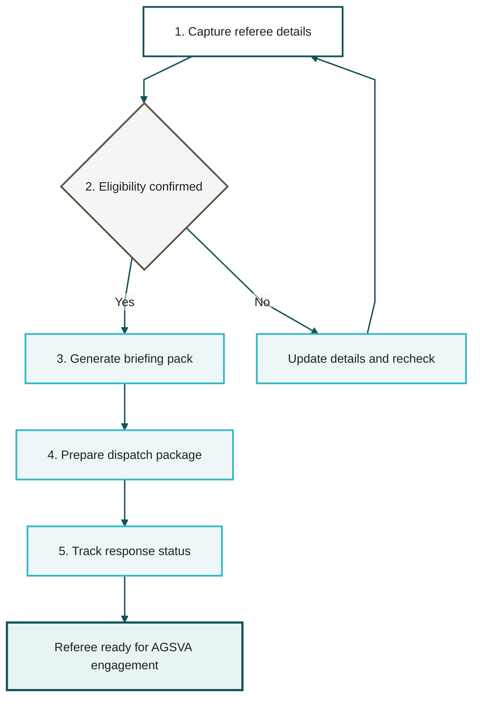

**Referee Briefing PDF Generator (Fortune 500 Quality)**

The referee briefing PDF represents the pinnacle of professional documentation quality. It must communicate:
- Applicant's professional background and achievements
- Security clearance context and importance
- Referee's specific role and expected input
- Clear instructions for AGSVA contact procedures
- Professional presentation matching C-suite standards

**PDF Structure:**

| Section | Content |
| --- | --- |
| Cover Page | Professional header, applicant name, referee name, confidentiality marking, generated date |
| Executive Summary | 1-paragraph overview of the clearance process and the referee's role |
| Applicant Profile | Minimal professional background relevant to the referee relationship |
| Professional Context | Description of ATO role, security clearance requirements, and baseline assessment context |
| Referee Guidelines | Expected questions, time commitment, response window, and manual dispatch expectations |
| Preparation Notes | Factual prompts to help the referee recall direct observations without scripted advocacy |
| Contact Information | AGSVA hotline, email, public website, and applicant-controlled contact route if approved |

*Referee Briefing PDF Structure*

**PDF Generation Technical Implementation:**
```js
// jsPDF + html2canvas Enterprise-Grade PDF Generation
async function generateRefereeBriefingPDF(applicantData, refereeData) {
    const pdf = new jsPDF('p', 'mm', 'a4');
    const pageWidth = pdf.internal.pageSize.getWidth();
    const pageHeight = pdf.internal.pageSize.getHeight();
    
    // Professional color scheme
    const primaryColor = [20, 82, 89]; // Deep teal
    const accentColor = [50, 184, 198]; // Bright teal
    const textColor = [31, 33, 33]; // Charcoal
    
    // Cover page with logo and professional header
    pdf.setFillColor(...primaryColor);
    pdf.rect(0, 0, pageWidth, 60, 'F');
    pdf.setTextColor(255, 255, 255);
    pdf.setFontSize(24);
    pdf.setFont('helvetica', 'bold');
    pdf.text('Security Clearance Referee Briefing', pageWidth/2, 30, { align: 'center' });
    
    // Applicant profile section with professional formatting
    pdf.addPage();
    renderProfileSection(pdf, applicantData);
    
    // Professional timeline chart (rendered from D3.js)
    const timelineCanvas = await html2canvas(document.getElementById('timeline-chart'));
    pdf.addImage(timelineCanvas, 'PNG', 20, 80, 170, 60);
    
    // Add footer with confidential marking
    addProfessionalFooter(pdf);
    
    return pdf;
}
```
**Visual Design Standards:**
- Professional typography (Helvetica, Arial, Open Sans)
- Consistent spacing and margins (professional white space)
- High-resolution graphics (300 DPI minimum)
- Color-coded sections for easy navigation
- Professional icons and visual separators
- Page numbering and document metadata

##### Research Insights

- Align the referee workflow to AGSVA's actual operating model: one online report, usually completed in 15-45 minutes, with a report link that expires after 15 business days.
- In the current browser-only scope, "Invitation Dispatch" should mean generating a polished PDF briefing and a controlled email/template package for the applicant to send manually.
- For reliable jsPDF output, preserve text as vector text where possible, subset/embed fonts intentionally, and normalize chart/image captures to predictable dimensions before pagination.
- Referee packs should apply strict minimization. Include only the applicant context needed for the referee role, not unnecessary identifiers or unrelated legal material.

**References:**
- AGSVA Referees: <https://www.agsva.gov.au/applicants/referees>
- AGSVA What to Expect Guide: <https://www.agsva.gov.au/sites/default/files/2024-08/agvsa_what_to_expect_guide_v3_0.pdf>
- jsPDF Repository and Examples: <https://github.com/parallax/jsPDF>

#### 2.3.5 Strategic Disclosure Advisor (AI-Powered Guidance)

**Concept:** Disclosure drafting assistant that helps the applicant prepare factual, contextual, evidence-indexed wording without substituting for legal review

**Key Features:**

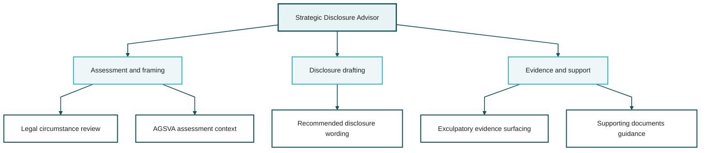

**Implementation Approach:**
```js
// Strategic Disclosure Recommendation Engine
function generateDisclosureRecommendation(legalProceedings, professionalProfile) {
    const recommendation = {
        approach: 'full-transparency-with-context',
        rationale: [],
        suggestedLanguage: '',
        supportingDocuments: [],
        reviewerNotice: 'This output is drafting assistance only and requires applicant review.'
    };
    
    // Analyze professional standing
    if (professionalProfile.careerLength >= 20 && professionalProfile.clearanceHistory.length > 0) {
        recommendation.rationale.push('Established professional history demonstrates trustworthiness');
    }
    
    // Analyze legal matter characteristics
    if (legalProceedings.type === 'traffic-administrative' && legalProceedings.exculpatoryEvidence.length > 0) {
        recommendation.approach = 'contextualized-disclosure';
        recommendation.suggestedLanguage = generateContextualizedDisclosure(legalProceedings);
    }
    
    return recommendation;
}
```
### 2.4 Visual Design System (C-Suite Standards)

#### 2.4.1 Color Palette (Professional & Sophisticated)

```css
:root {
    /* Primary Colors */
    --color-primary: #145259;           /* Deep Teal */
    --color-primary-light: #32B8C6;     /* Bright Teal */
    --color-accent: #5E5240;            /* Warm Brown */
    
    /* Neutral Colors */
    --color-bg-primary: #FCFCF9;        /* Cream */
    --color-bg-secondary: #F5F5F5;      /* Light Gray */
    --color-text-primary: #1F2121;      /* Charcoal */
    --color-text-secondary: #626C71;    /* Slate */
    
    /* Status Colors */
    --color-success: #218D8D;           /* Teal Green */
    --color-warning: #A84B2F;           /* Burnt Orange */
    --color-error: #C0152F;             /* Deep Red */
    --color-info: #145259;              /* Information Blue */
    
    /* Gradients */
    --gradient-primary: linear-gradient(135deg, #145259 0%, #32B8C6 100%);
    --gradient-accent: linear-gradient(135deg, #5E5240 0%, #A84B2F 100%);
}
```
#### 2.4.2 Typography Hierarchy

```css
/* Professional Typography System - self-hosted assets only */
@font-face {
    font-family: 'Inter';
    src: url('/assets/fonts/inter/inter-var.woff2') format('woff2');
    font-display: swap;
}

@font-face {
    font-family: 'Playfair Display';
    src: url('/assets/fonts/playfair-display/playfair-display-700.woff2') format('woff2');
    font-display: swap;
}

:root {
    /* Font Families */
    --font-primary: 'Inter', -apple-system, BlinkMacSystemFont, sans-serif;
    --font-display: 'Playfair Display', Georgia, serif;
    --font-mono: 'SF Mono', Monaco, 'Cascadia Code', monospace;
    
    /* Font Sizes */
    --font-size-xs: 0.75rem;    /* 12px */
    --font-size-sm: 0.875rem;   /* 14px */
    --font-size-base: 1rem;     /* 16px */
    --font-size-lg: 1.125rem;   /* 18px */
    --font-size-xl: 1.25rem;    /* 20px */
    --font-size-2xl: 1.5rem;    /* 24px */
    --font-size-3xl: 1.875rem;  /* 30px */
    --font-size-4xl: 2.25rem;   /* 36px */
    --font-size-5xl: 3rem;      /* 48px */
    
    /* Line Heights */
    --line-height-tight: 1.25;
    --line-height-normal: 1.5;
    --line-height-relaxed: 1.75;
}
```
#### 2.4.3 Animation Standards

All animations must maintain 60fps performance and follow professional easing curves:

```js
// GSAP Animation Presets (C-Suite Quality)
const animationPresets = {
    fadeInUp: {
        opacity: 0,
        y: 30,
        duration: 0.8,
        ease: 'power3.out'
    },
    scaleIn: {
        scale: 0.95,
        opacity: 0,
        duration: 0.6,
        ease: 'back.out(1.7)'
    },
    slideInRight: {
        x: 50,
        opacity: 0,
        duration: 0.7,
        ease: 'power2.out'
    },
    staggerChildren: {
        stagger: 0.1,
        ease: 'power2.inOut'
    }
};

// Scroll-triggered animations
ScrollTrigger.create({
    trigger: '.section',
    start: 'top 80%',
    animation: gsap.from('.section-element', animationPresets.fadeInUp),
    toggleActions: 'play none none reverse'
});

```

## PART III: DETAILED IMPLEMENTATION PLAN

### 3.1 Development Phases & Timeline

```mermaid
%%{init: {'theme': 'base', 'themeVariables': { 'background': '#FCFCF9', 'primaryColor': '#FFFFFF', 'primaryTextColor': '#1F2121', 'primaryBorderColor': '#145259', 'lineColor': '#145259', 'secondaryColor': '#F5F5F5', 'tertiaryColor': '#E7F3F4', 'clusterBkg': '#F8F8F6', 'clusterBorder': '#A7B3B6', 'edgeLabelBackground': '#FCFCF9', 'fontFamily': 'Helvetica, Arial, sans-serif', 'fontSize': '14px' }, 'flowchart': { 'curve': 'linear', 'nodeSpacing': 38, 'rankSpacing': 54, 'padding': 18, 'htmlLabels': false } } }%%
flowchart TB
    classDef kickoff fill:#E7F3F4,stroke:#145259,stroke-width:2.5px,color:#1F2121;
    classDef phase fill:#FFFFFF,stroke:#145259,stroke-width:2px,color:#1F2121;
    classDef deliverable fill:#F5F5F5,stroke:#5E5240,stroke-width:2px,color:#1F2121;
    classDef milestone fill:#EEF6F7,stroke:#32B8C6,stroke-width:2.5px,color:#1F2121;
    linkStyle default stroke:#145259,stroke-width:1.6px;

    kickoff[Program kickoff]
    p1[Phase 1: Foundation (3-4 days)]
    p2[Phase 2: Core features (5-7 days)]
    p3[Phase 3: Visualizations (4-5 days)]
    p4[Phase 4: Referee system (3-4 days)]
    p5[Phase 5: Intelligence (2-3 days)]
    p6[Phase 6: Polish (3-4 days)]
    total[MVP in 20-27 days plus hardening release]
    d1[HTML shell, design system, responsive layout]
    d2[Upload workflow, validation, IndexedDB, tracker]
    d3[Three.js scene, D3 charts, progress dashboards]
    d4[Nomination forms, PDF generation, briefing pack]
    d5[Disclosure drafting aid, evidence index, review logic]
    d6[Animation, accessibility, performance hardening]

    kickoff --> p1
    p1 --> p2
    p2 --> p3
    p3 --> p4
    p4 --> p5
    p5 --> p6
    p6 --> total

    p1 -.-> d1
    p2 -.-> d2
    p3 -.-> d3
    p4 -.-> d4
    p5 -.-> d5
    p6 -.-> d6

    class kickoff kickoff
    class p1,p2,p3,p4,p5,p6 phase
    class d1,d2,d3,d4,d5,d6 deliverable
    class total milestone
```

*Development Phase Timeline*

### 3.2 File Structure & Organization
```bash
agsva-clearance-platform/
│
├── index.html                          # Main application entry point
├── assets/
│   ├── css/
│   │   ├── main.css                    # Core styles
│   │   ├── components.css              # Component-specific styles
│   │   ├── animations.css              # Animation definitions
│   │   └── responsive.css              # Media queries
│   │
│   ├── js/
│   │   ├── app.js                      # Application initialization
│   │   ├── modules/
│   │   │   ├── document-manager.js     # Document upload/management
│   │   │   ├── form-validator.js       # Form validation logic
│   │   │   ├── progress-tracker.js     # Requirements tracking
│   │   │   ├── referee-system.js       # Referee management
│   │   │   ├── pdf-generator.js        # PDF creation engine
│   │   │   ├── disclosure-advisor.js   # Strategic guidance
│   │   │   └── data-storage.js         # IndexedDB operations
│   │   │
│   │   ├── visualizations/
│   │   │   ├── three-scene.js          # Three.js 3D environment
│   │   │   ├── d3-charts.js            # D3.js visualizations
│   │   │   └── chart-configs.js        # Chart.js configurations
│   │   │
│   │   └── utils/
│   │       ├── helpers.js              # Utility functions
│   │       ├── constants.js            # Application constants
│   │       └── api-client.js           # Future API integration
│   │
│   ├── images/
│   │   ├── logos/
│   │   ├── icons/
│   │   ├── backgrounds/
│   │   └── 3d-models/                  # GLTF/GLB files
│   │
│   └── fonts/
│       ├── inter/
│       └── playfair-display/
│
├── components/
│   ├── dashboard.html                  # Dashboard component
│   ├── document-upload.html            # Upload interface
│   ├── requirements-tracker.html       # Progress tracking
│   ├── referee-portal.html             # Referee management
│   └── disclosure-advisor.html         # Strategic guidance
│
├── lib/                                # Third-party libraries
│   ├── three.min.js
│   ├── d3.min.js
│   ├── gsap.min.js
│   ├── jspdf.min.js
│   └── html2canvas.min.js
│
├── data/
│   ├── requirements.json               # AGSVA requirements data
│   ├── workspace-template.json         # Blank local-first workspace seed
│   └── document-checklist.json         # Document categories
│
└── docs/
    ├── architecture.md
    ├── api-reference.md
    └── deployment-guide.md
```
### 3.3 Key Implementation Details

#### 3.3.1 Main Application Entry (index.html)
```html
<!DOCTYPE html>
<html lang="en">
<head>
    <meta charset="UTF-8">
    <meta name="viewport" content="width=device-width, initial-scale=1.0">
    <title>AGSVA Baseline Clearance Platform | Vikram Deshpande</title>
    
    <!-- Preload critical resources -->
    <link rel="preload" href="assets/fonts/inter/inter-var.woff2" as="font" type="font/woff2" crossorigin>
    <link rel="preload" href="lib/three.min.js" as="script">
    
    <!-- Stylesheets -->
    <link rel="stylesheet" href="assets/css/main.css">
    <link rel="stylesheet" href="assets/css/components.css">
    <link rel="stylesheet" href="assets/css/animations.css">
    
    <!-- Favicon and meta -->
    <link rel="icon" type="image/svg+xml" href="assets/images/favicon.svg">
    <meta name="description" content="Enterprise-grade AGSVA Baseline Security Clearance application platform">
    
    <!-- Open Graph metadata -->
    <meta property="og:title" content="AGSVA Clearance Platform">
    <meta property="og:description" content="Professional security clearance application system">
</head>
<body>
    <!-- Three.js Background Canvas -->
    <canvas id="threejs-canvas"></canvas>
    
    <!-- Main Application Container -->
    <div id="app-container">
        <!-- Navigation -->
        <nav class="main-nav">
            <div class="nav-brand">
                <h1>AGSVA Clearance Platform</h1>
            </div>
            <ul class="nav-menu">
                <li><a href="#dashboard">Dashboard</a></li>
                <li><a href="#requirements">Requirements</a></li>
                <li><a href="#documents">Documents</a></li>
                <li><a href="#referees">Referees</a></li>
                <li><a href="#disclosure">Disclosure</a></li>
            </ul>
        </nav>
        
        <!-- Hero Section with 3D Visualization -->
        <section id="hero" class="hero-section">
            <div class="hero-content">
                <h1 class="hero-title">Baseline Security Clearance</h1>
                <p class="hero-subtitle">Australian Taxation Office Application</p>
                <div class="hero-stats">
                    <div class="stat-card">
                        <span class="stat-value" id="completion-percentage">0%</span>
                        <span class="stat-label">Complete</span>
                    </div>
                    <div class="stat-card">
                        <span class="stat-value" id="days-remaining">20</span>
                        <span class="stat-label">Days Remaining</span>
                    </div>
                    <div class="stat-card">
                        <span class="stat-value" id="documents-uploaded">0/12</span>
                        <span class="stat-label">Documents</span>
                    </div>
                </div>
            </div>
        </section>
        
        <!-- Dashboard Section -->
        <section id="dashboard" class="dashboard-section">
            <div class="container">
                <h2 class="section-title">Application Dashboard</h2>
                
                <!-- Progress Overview -->
                <div class="dashboard-grid">
                    <div class="dashboard-card">
                        <h3>Overall Progress</h3>
                        <div id="radial-progress-chart"></div>
                    </div>
                    
                    <div class="dashboard-card">
                        <h3>Timeline</h3>
                        <div id="timeline-visualization"></div>
                    </div>
                    
                    <div class="dashboard-card">
                        <h3>Requirements Status</h3>
                        <div id="requirements-matrix"></div>
                    </div>
                    
                    <div class="dashboard-card">
                        <h3>Critical Actions</h3>
                        <div id="action-items-list"></div>
                    </div>
                </div>
            </div>
        </section>
        
        <!-- Requirements Tracker Section -->
        <section id="requirements" class="requirements-section">
            <div class="container">
                <h2 class="section-title">Baseline Clearance Requirements</h2>
                
                <div class="requirements-accordion">
                    <!-- Personal Information -->
                    <div class="accordion-item">
                        <div class="accordion-header">
                            <h3>Personal Information</h3>
                            <span class="status-badge status-incomplete">Incomplete</span>
                        </div>
                        <div class="accordion-content">
                            <form id="personal-info-form">
                                <!-- Form fields generated dynamically -->
                            </form>
                        </div>
                    </div>
                    
                    <!-- Employment History -->
                    <div class="accordion-item">
                        <div class="accordion-header">
                            <h3>Employment History (5 Years)</h3>
                            <span class="status-badge status-incomplete">Incomplete</span>
                        </div>
                        <div class="accordion-content">
                            <div id="employment-history-tracker"></div>
                        </div>
                    </div>
                    
                    <!-- Address History -->
                    <div class="accordion-item">
                        <div class="accordion-header">
                            <h3>Address History (5 Years)</h3>
                            <span class="status-badge status-incomplete">Incomplete</span>
                        </div>
                        <div class="accordion-content">
                            <div id="address-history-tracker"></div>
                        </div>
                    </div>
                    
                    <!-- Additional sections dynamically loaded -->
                </div>
            </div>
        </section>
        
        <!-- Document Management Section -->
        <section id="documents" class="documents-section">
            <div class="container">
                <h2 class="section-title">Document Management</h2>
                
                <div class="document-upload-area">
                    <div class="upload-zone" id="drop-zone">
                        <svg class="upload-icon"><!-- Upload icon SVG --></svg>
                        <p>Drag & drop documents here or click to browse</p>
                        <input type="file" id="file-input" multiple accept=".pdf,.jpg,.jpeg,.png">
                    </div>
                </div>
                
                <div class="document-checklist">
                    <h3>Required Documents</h3>
                    <div id="document-checklist-grid">
                        <!-- Checklist items generated dynamically -->
                    </div>
                </div>
                
                <div class="uploaded-documents">
                    <h3>Uploaded Documents</h3>
                    <div id="uploaded-documents-list">
                        <!-- Document cards generated dynamically -->
                    </div>
                </div>
            </div>
        </section>
        
        <!-- Referee Management Section -->
        <section id="referees" class="referees-section">
            <div class="container">
                <h2 class="section-title">Referee Management</h2>
                
                <div class="referee-requirements-card">
                    <h3>Baseline Requirements</h3>
                    <p>1 professional referee (supervisor) covering at least 3 months</p>
                </div>
                
                <div class="referee-nomination-form">
                    <h3>Nominate Referee</h3>
                    <form id="referee-form">
                        <!-- Referee form fields -->
                    </form>
                </div>
                
                <div class="referee-list">
                    <h3>Nominated Referees</h3>
                    <div id="referee-cards-container">
                        <!-- Referee cards generated dynamically -->
                    </div>
                </div>
                
                <div class="referee-briefing-generator">
                    <h3>Generate Referee Briefing</h3>
                    <button id="generate-briefing-btn" class="btn-primary">
                        Generate Professional PDF Briefing
                    </button>
                    <div id="briefing-preview"></div>
                </div>
            </div>
        </section>
        
        <!-- Strategic Disclosure Section -->
        <section id="disclosure" class="disclosure-section">
            <div class="container">
                <h2 class="section-title">Strategic Disclosure Advisor</h2>
                
                <div class="disclosure-context">
                    <h3>Legal Proceedings Context</h3>
                    <div id="legal-context-summary"></div>
                </div>
                
                <div class="disclosure-recommendation">
                    <h3>Recommended Disclosure Approach</h3>
                    <div id="disclosure-guidance"></div>
                </div>
                
                <div class="disclosure-preview">
                    <h3>Preview Your Disclosure</h3>
                    <textarea id="disclosure-text" rows="8"></textarea>
                </div>
            </div>
        </section>
    </div>
    
    <!-- JavaScript Libraries -->
    <script src="lib/three.min.js"></script>
    <script src="lib/d3.min.js"></script>
    <script src="lib/gsap.min.js"></script>
    <script src="lib/ScrollTrigger.min.js"></script>
    <script src="lib/jspdf.min.js"></script>
    <script src="lib/html2canvas.min.js"></script>
    
    <!-- Application Scripts -->
    <script type="module" src="assets/js/app.js"></script>
</body>
</html>
```
#### 3.3.2 Application Initialization (app.js)

// Main Application Controller
```js
import DocumentManager from './modules/document-manager.js';
import FormValidator from './modules/form-validator.js';
import ProgressTracker from './modules/progress-tracker.js';
import RefereeSystem from './modules/referee-system.js';
import PDFGenerator from './modules/pdf-generator.js';
import DisclosureAdvisor from './modules/disclosure-advisor.js';
import { initThreeJsScene } from './visualizations/three-scene.js';
import { initD3Charts } from './visualizations/d3-charts.js';

class AGSVAClearanceApp {
    constructor() {
        this.state = {
            applicant: {},
            documents: [],
            referees: [],
            progress: 0,
            completionStatus: {}
        };
        
        this.modules = {};
        this.init();
    }
    
    async init() {
        console.log('Initializing AGSVA Clearance Platform...');
        
        // Load blank workspace seed
        await this.loadApplicantProfile();
        
        // Initialize modules
        this.modules.documentManager = new DocumentManager();
        this.modules.formValidator = new FormValidator();
        this.modules.progressTracker = new ProgressTracker();
        this.modules.refereeSystem = new RefereeSystem();
        this.modules.pdfGenerator = new PDFGenerator();
        this.modules.disclosureAdvisor = new DisclosureAdvisor();
        
        // Initialize visualizations
        initThreeJsScene();
        initD3Charts();
        
        // Setup event listeners
        this.setupEventListeners();
        
        // Initialize GSAP animations
        this.initAnimations();
        
        // Restore session if available
        this.restoreSession();
        
        console.log('Platform initialized successfully');
    }
    
    async loadApplicantProfile() {
        this.state.applicant = this.getBlankProfile();
    }
    
    getBlankProfile() {
        return {
            personalInfo: {
                fullName: '',
                citizenship: '',
                currentAddress: '',
                phone: '',
                email: ''
            },
            professionalInfo: {
                currentEmployer: '',
                position: '',
                careerLength: 0,
                clearanceHistory: []
            },
            legalProceedings: {
                type: '',
                status: '',
                exculpatoryEvidence: []
            }
        };
    }
    
    setupEventListeners() {
        // Document upload
        document.getElementById('file-input').addEventListener('change', (e) => {
            this.modules.documentManager.handleFileUpload(e.target.files);
        });
        
        // Drag and drop
        const dropZone = document.getElementById('drop-zone');
        dropZone.addEventListener('dragover', (e) => e.preventDefault());
        dropZone.addEventListener('drop', (e) => {
            e.preventDefault();
            this.modules.documentManager.handleFileUpload(e.dataTransfer.files);
        });
        
        // Referee form submission
        document.getElementById('referee-form').addEventListener('submit', (e) => {
            e.preventDefault();
            this.modules.refereeSystem.nominateReferee(new FormData(e.target));
        });
        
        // PDF generation
        document.getElementById('generate-briefing-btn').addEventListener('click', () => {
            this.modules.pdfGenerator.generateRefereeBriefing(
                this.state.applicant,
                this.state.referees[0]
            );
        });
        
        // Auto-save functionality
        setInterval(() => this.autoSave(), 30000); // Every 30 seconds
    }
    
    initAnimations() {
        // Scroll-triggered animations
        gsap.registerPlugin(ScrollTrigger);
        
        gsap.from('.section-title', {
            scrollTrigger: {
                trigger: '.section-title',
                start: 'top 80%',
            },
            opacity: 0,
            y: 50,
            duration: 0.8,
            ease: 'power3.out',
            stagger: 0.2
        });
        
        // Animate stat cards on load
        gsap.from('.stat-card', {
            scale: 0.8,
            opacity: 0,
            duration: 0.6,
            stagger: 0.15,
            ease: 'back.out(1.7)',
            delay: 0.5
        });
    }
    
    autoSave() {
        try {
            sessionStorage.setItem('agsva-app-state', JSON.stringify(this.state));
            console.log('Auto-save completed');
        } catch (error) {
            console.error('Auto-save failed:', error);
        }
    }
    
    restoreSession() {
        try {
            const savedState = sessionStorage.getItem('agsva-app-state');
            if (savedState) {
                this.state = { ...this.state, ...JSON.parse(savedState) };
                this.modules.progressTracker.updateProgress(this.state.progress);
                console.log('Session restored');
            }
        } catch (error) {
            console.error('Session restore failed:', error);
        }
    }
}

// Initialize application when DOM is ready
document.addEventListener('DOMContentLoaded', () => {
    window.agsvaApp = new AGSVAClearanceApp();
});
```
#### 3.3.3 PDF Generator Module (pdf-generator.js)
```js
// Enterprise-Grade PDF Generation for Referee Briefings
export default class PDFGenerator {
    constructor() {
        this.pageWidth = 210; // A4 width in mm
        this.pageHeight = 297; // A4 height in mm
        this.margin = 20;
        this.colorScheme = {
            primary: [20, 82, 89],
            accent: [50, 184, 198],
            text: [31, 33, 33],
            lightGray: [245, 245, 245]
        };
    }
    
    async generateRefereeBriefing(applicantData, refereeData) {
        const pdf = new jsPDF('p', 'mm', 'a4');
        
        // Cover page
        this.renderCoverPage(pdf, applicantData, refereeData);
        
        // Table of contents
        pdf.addPage();
        this.renderTableOfContents(pdf);
        
        // Executive summary
        pdf.addPage();
        this.renderExecutiveSummary(pdf, applicantData);
        
        // Applicant profile
        pdf.addPage();
        await this.renderApplicantProfile(pdf, applicantData);
        
        // Professional context
        pdf.addPage();
        this.renderProfessionalContext(pdf);
        
        // Referee guidelines
        pdf.addPage();
        this.renderRefereeGuidelines(pdf);
        
        // Referee preparation notes
        pdf.addPage();
        this.renderPreparationNotes(pdf, applicantData, refereeData);
        
        // Contact information
        pdf.addPage();
        this.renderContactInformation(pdf);
        
        // Add professional footer to all pages
        this.addFooters(pdf);
        
        // Save PDF
        const filename = `AGSVA_Referee_Briefing_${applicantData.personalInfo.fullName.replace(' ', '_')}_${Date.now()}.pdf`;
        pdf.save(filename);
        
        return pdf;
    }
    
    renderCoverPage(pdf, applicantData, refereeData) {
        const { primary, accent } = this.colorScheme;
        
        // Header background
        pdf.setFillColor(...primary);
        pdf.rect(0, 0, this.pageWidth, 80, 'F');
        
        // Title
        pdf.setTextColor(255, 255, 255);
        pdf.setFontSize(28);
        pdf.setFont('helvetica', 'bold');
        pdf.text('SECURITY CLEARANCE', this.pageWidth / 2, 35, { align: 'center' });
        pdf.text('REFEREE BRIEFING', this.pageWidth / 2, 50, { align: 'center' });
        
        // Accent line
        pdf.setDrawColor(...accent);
        pdf.setLineWidth(2);
        pdf.line(60, 60, this.pageWidth - 60, 60);
        
        // Confidential marking
        pdf.setFontSize(12);
        pdf.setFont('helvetica', 'normal');
        pdf.text('CONFIDENTIAL', this.pageWidth / 2, 70, { align: 'center' });
        
        // Applicant information box
        pdf.setFillColor(245, 245, 245);
        pdf.rect(this.margin, 100, this.pageWidth - 2 * this.margin, 50, 'F');
        
        pdf.setTextColor(...this.colorScheme.text);
        pdf.setFontSize(14);
        pdf.setFont('helvetica', 'bold');
        pdf.text('APPLICANT:', this.margin + 10, 115);
        pdf.setFont('helvetica', 'normal');
        pdf.text(applicantData.personalInfo.fullName, this.margin + 10, 125);
        
        pdf.setFont('helvetica', 'bold');
        pdf.text('REFEREE:', this.margin + 10, 140);
        pdf.setFont('helvetica', 'normal');
        pdf.text(refereeData.fullName, this.margin + 10, 150);
        
        // Security classification
        pdf.setFontSize(10);
        pdf.setTextColor(150, 150, 150);
        pdf.text('Australian Government Security Vetting Agency (AGSVA)', this.pageWidth / 2, 170, { align: 'center' });
        pdf.text('Baseline Security Clearance Application', this.pageWidth / 2, 178, { align: 'center' });
        
        // Date
        pdf.setFontSize(11);
        pdf.setTextColor(...this.colorScheme.text);
        const currentDate = new Date().toLocaleDateString('en-AU', { 
            year: 'numeric', 
            month: 'long', 
            day: 'numeric' 
        });
        pdf.text(`Date Issued: ${currentDate}`, this.pageWidth / 2, 200, { align: 'center' });
        
        // Footer disclaimer
        pdf.setFontSize(9);
        pdf.setTextColor(100, 100, 100);
        const disclaimer = 'This document contains confidential information for referee use only. Please handle in accordance with AGSVA guidelines.';
        pdf.text(disclaimer, this.pageWidth / 2, this.pageHeight - 15, { 
            align: 'center', 
            maxWidth: this.pageWidth - 2 * this.margin 
        });
    }
    
    renderTableOfContents(pdf) {
        pdf.setFontSize(20);
        pdf.setFont('helvetica', 'bold');
        pdf.setTextColor(...this.colorScheme.primary);
        pdf.text('TABLE OF CONTENTS', this.margin, 30);
        
        const contents = [
            { title: '1. Executive Summary', page: 3 },
            { title: '2. Applicant Professional Profile', page: 4 },
            { title: '3. Professional Context & Security Clearance Requirements', page: 5 },
            { title: '4. Referee Role & Guidelines', page: 6 },
            { title: '5. Referee Preparation Notes', page: 7 },
            { title: '6. Contact Information & Resources', page: 8 }
        ];
        
        pdf.setFontSize(12);
        pdf.setFont('helvetica', 'normal');
        pdf.setTextColor(...this.colorScheme.text);
        
        let y = 50;
        contents.forEach(item => {
            pdf.text(item.title, this.margin + 5, y);
            pdf.text(item.page.toString(), this.pageWidth - this.margin - 10, y, { align: 'right' });
            
            // Dotted line
            pdf.setLineDash([1, 1]);
            pdf.setDrawColor(200, 200, 200);
            pdf.line(this.margin + 5, y + 2, this.pageWidth - this.margin - 15, y + 2);
            pdf.setLineDash([]);
            
            y += 12;
        });
    }
    
    renderExecutiveSummary(pdf, applicantData) {
        pdf.setFontSize(20);
        pdf.setFont('helvetica', 'bold');
        pdf.setTextColor(...this.colorScheme.primary);
        pdf.text('EXECUTIVE SUMMARY', this.margin, 30);
        
        pdf.setFontSize(11);
        pdf.setFont('helvetica', 'normal');
        pdf.setTextColor(...this.colorScheme.text);
        
        const summary = `${applicantData.personalInfo.fullName} has nominated you as a professional referee for their Australian Government Baseline Security Clearance application. This clearance is required for their prospective role with the Australian Taxation Office (ATO).

As a referee, you play a crucial role in the security clearance assessment process. The Australian Government Security Vetting Agency (AGSVA) may contact you to verify information provided by the applicant and to gain insights into their character, trustworthiness, and suitability for handling PROTECTED classified information.

This briefing document provides:
• Comprehensive background on the applicant's professional history
• Context about security clearance requirements and the vetting process
• Clear guidelines on your role and what to expect
• Preparation notes to help you respond from direct professional knowledge
• Contact information and resources

Your cooperation and timely response will significantly assist in the efficient processing of this clearance application.`;
        
        pdf.text(summary, this.margin, 45, {
            maxWidth: this.pageWidth - 2 * this.margin,
            lineHeightFactor: 1.6
        });
    }
    
    async renderApplicantProfile(pdf, applicantData) {
        pdf.setFontSize(20);
        pdf.setFont('helvetica', 'bold');
        pdf.setTextColor(...this.colorScheme.primary);
        pdf.text('APPLICANT PROFESSIONAL PROFILE', this.margin, 30);
        
        // Professional summary section
        pdf.setFontSize(14);
        pdf.setTextColor(...this.colorScheme.accent);
        pdf.text('Professional Summary', this.margin, 45);
        
        pdf.setFontSize(11);
        pdf.setFont('helvetica', 'normal');
        pdf.setTextColor(...this.colorScheme.text);
        
        const professionalSummary = `${applicantData.personalInfo.fullName} is a highly experienced technology professional with ${applicantData.professionalInfo.careerLength} years of demonstrated excellence in technical leadership roles. Currently serving as a ${applicantData.professionalInfo.position}, they have consistently contributed to critical digital infrastructure projects for both civilian and governmental sectors.

Key Professional Attributes:
• Unblemished ${applicantData.professionalInfo.careerLength}-year career history
• Senior Technical Leader managing complex, high-value projects
• Experience with security-sensitive government contracts
• Proven track record of professional integrity and reliability`;
        
        pdf.text(professionalSummary, this.margin, 55, {
            maxWidth: this.pageWidth - 2 * this.margin,
            lineHeightFactor: 1.6
        });
        
        // Employment history table
        pdf.setFontSize(14);
        pdf.setTextColor(...this.colorScheme.accent);
        pdf.text('Recent Employment History (5 Years)', this.margin, 135);
        
        // Note: In production, this would render actual employment data
        pdf.setFontSize(10);
        pdf.setFont('helvetica', 'italic');
        pdf.text('Employment history details are available in the applicant\'s formal application', this.margin, 145);
        
        // Technical expertise section
        pdf.setFontSize(14);
        pdf.setFont('helvetica', 'bold');
        pdf.setTextColor(...this.colorScheme.accent);
        pdf.text('Technical Expertise', this.margin, 165);
        
        pdf.setFontSize(11);
        pdf.setFont('helvetica', 'normal');
        pdf.setTextColor(...this.colorScheme.text);
        
        const expertise = `• Full-stack web application development
• AI systems and agentic programming
• DevOps and infrastructure management
• Security-conscious system design
• Project leadership and team management`;
        
        pdf.text(expertise, this.margin + 5, 175, {
            maxWidth: this.pageWidth - 2 * this.margin - 10,
            lineHeightFactor: 1.8
        });
    }
    
    renderProfessionalContext(pdf) {
        pdf.setFontSize(20);
        pdf.setFont('helvetica', 'bold');
        pdf.setTextColor(...this.colorScheme.primary);
        pdf.text('PROFESSIONAL CONTEXT', this.margin, 30);
        
        // ATO role section
        pdf.setFontSize(14);
        pdf.setTextColor(...this.colorScheme.accent);
        pdf.text('Target Role: Australian Taxation Office', this.margin, 45);
        
        pdf.setFontSize(11);
        pdf.setFont('helvetica', 'normal');
        pdf.setTextColor(...this.colorScheme.text);
        
        const roleContext = `The applicant is pursuing a technical position with the Australian Taxation Office that requires ongoing access to PROTECTED classified resources. This clearance level permits access to sensitive government information that, if compromised, could reasonably be expected to cause damage to the national interest, organizations, or individuals.`;
        
        pdf.text(roleContext, this.margin, 55, {
            maxWidth: this.pageWidth - 2 * this.margin,
            lineHeightFactor: 1.6
        });
        
        // Clearance requirements section
        pdf.setFontSize(14);
        pdf.setTextColor(...this.colorScheme.accent);
        pdf.text('Baseline Security Clearance Requirements', this.margin, 85);
        
        pdf.setFontSize(11);
        pdf.setFont('helvetica', 'normal');
        pdf.setTextColor(...this.colorScheme.text);
        
        const requirements = `AGSVA assesses security clearance suitability based on personal qualities that demonstrate integrity and trustworthiness:

Core Assessment Criteria:
• Honesty and transparency in all dealings
• Trustworthiness in handling sensitive information
• Maturity and sound judgment
• Tolerance and respect for diversity
• Resilience under pressure
• Loyalty to Australia and its interests

The vetting process examines the applicant's background, character, and circumstances to determine if they pose any security risk and can be trusted with classified resources.`;
        
        pdf.text(requirements, this.margin, 95, {
            maxWidth: this.pageWidth - 2 * this.margin,
            lineHeightFactor: 1.6
        });
    }
    
    renderRefereeGuidelines(pdf) {
        pdf.setFontSize(20);
        pdf.setFont('helvetica', 'bold');
        pdf.setTextColor(...this.colorScheme.primary);
        pdf.text('REFEREE ROLE & GUIDELINES', this.margin, 30);
        
        // What to expect section
        pdf.setFontSize(14);
        pdf.setTextColor(...this.colorScheme.accent);
        pdf.text('What to Expect', this.margin, 45);
        
        pdf.setFontSize(11);
        pdf.setFont('helvetica', 'normal');
        pdf.setTextColor(...this.colorScheme.text);
        
        const expectations = `As a nominated referee, you may be contacted by AGSVA in one or more of the following ways:

1. Online Referee Report: You will receive an email with a unique link to complete a standardized online questionnaire. You have 15 business days to complete this report.

2. Phone Interview: An AGSVA representative may call to discuss your responses or ask follow-up questions.

3. Written Correspondence: You may receive additional questions via email requiring written responses.

The process is designed to be respectful of your time while gathering necessary information to assess the applicant's suitability.`;
        
        pdf.text(expectations, this.margin, 55, {
            maxWidth: this.pageWidth - 2 * this.margin,
            lineHeightFactor: 1.6
        });
        
        // Questions you may be asked
        pdf.setFontSize(14);
        pdf.setTextColor(...this.colorScheme.accent);
        pdf.text('Questions You May Be Asked', this.margin, 125);
        
        pdf.setFontSize(11);
        pdf.setFont('helvetica', 'normal');
        pdf.setTextColor(...this.colorScheme.text);
        
        const questions = `AGSVA referees are typically asked to comment on:

• The nature and duration of your relationship with the applicant
• The applicant's character, honesty, and trustworthiness
• Professional competence and work ethic
• Reliability and punctuality
• Ability to handle stress and maintain confidentiality
• Any concerns about their suitability for a security clearance
• Financial responsibility (if relevant to your knowledge)
• Social relationships and lifestyle factors (if relevant)

You should answer honestly and objectively. If you don't have knowledge about a particular area, it's appropriate to say so.`;
        
        pdf.text(questions, this.margin, 135, {
            maxWidth: this.pageWidth - 2 * this.margin,
            lineHeightFactor: 1.6
        });
        
        // Important note
        pdf.setFillColor(255, 250, 240);
        pdf.rect(this.margin, 215, this.pageWidth - 2 * this.margin, 30, 'F');
        
        pdf.setFontSize(10);
        pdf.setFont('helvetica', 'bold');
        pdf.setTextColor(...this.colorScheme.primary);
        pdf.text('IMPORTANT:', this.margin + 5, 223);
        
        pdf.setFont('helvetica', 'normal');
        pdf.setTextColor(...this.colorScheme.text);
        const note = 'Referee availability and responsiveness is critical. Delays in referee contact are one of the primary causes of security clearance processing delays. Your prompt response will significantly assist the applicant.';
        pdf.text(note, this.margin + 5, 230, {
            maxWidth: this.pageWidth - 2 * this.margin - 10,
            lineHeightFactor: 1.5
        });
    }
    
    renderPreparationNotes(pdf, applicantData, refereeData) {
        pdf.setFontSize(20);
        pdf.setFont('helvetica', 'bold');
        pdf.setTextColor(...this.colorScheme.primary);
        pdf.text('REFEREE PREPARATION NOTES', this.margin, 30);
        
        pdf.setFontSize(11);
        pdf.setFont('helvetica', 'normal');
        pdf.setTextColor(...this.colorScheme.text);
        
        const templateText = `Use the prompts below to prepare for AGSVA contact. The intent is to support factual recall from direct professional knowledge rather than provide scripted advocacy.

---
1. Confirm the relationship:
- How long have you supervised or worked closely with ${applicantData.personalInfo.fullName}?
- What was the nature and frequency of contact?

2. Prepare factual examples:
- Reliability and follow-through
- Integrity and honesty
- Professional judgment
- Handling of sensitive or high-trust work

3. Stay within direct knowledge:
- Say plainly when a topic is outside your visibility
- Avoid speculation, coaching language, or unsupported claims

4. Response posture:
- Complete the online report promptly if contacted
- Keep answers concise, accurate, and professional

Referee of record: ${refereeData.fullName}
---`;
        
        pdf.text(templateText, this.margin, 45, {
            maxWidth: this.pageWidth - 2 * this.margin,
            lineHeightFactor: 1.5
        });
    }
    
    renderContactInformation(pdf) {
        pdf.setFontSize(20);
        pdf.setFont('helvetica', 'bold');
        pdf.setTextColor(...this.colorScheme.primary);
        pdf.text('CONTACT INFORMATION', this.margin, 30);
        
        // AGSVA contact details
        pdf.setFontSize(14);
        pdf.setTextColor(...this.colorScheme.accent);
        pdf.text('AGSVA Contact Details', this.margin, 45);
        
        pdf.setFontSize(11);
        pdf.setFont('helvetica', 'normal');
        pdf.setTextColor(...this.colorScheme.text);
        
        const agsvaContact = `Australian Government Security Vetting Agency (AGSVA)


Phone: 1800 640 450
Email: securityclearances@defence.gov.au
Website: www.agsva.gov.au
Business Hours: Monday - Friday, 8:30 AM - 5:00 PM AEST`;
        
        pdf.text(agsvaContact, this.margin, 55, {
            maxWidth: this.pageWidth - 2 * this.margin,
            lineHeightFactor: 1.8
        });
        
        // Applicant contact (if you have questions)
        pdf.setFontSize(14);
        pdf.setTextColor(...this.colorScheme.accent);
        pdf.text('Applicant Contact', this.margin, 115);
        
        pdf.setFontSize(11);
        pdf.setFont('helvetica', 'normal');
        pdf.setTextColor(...this.colorScheme.text);
        
const applicantContact = `If you need clarification about your relationship with the applicant, use the applicant-controlled contact route that is inserted only after final review of the briefing pack.`;
        
        pdf.text(applicantContact, this.margin, 125, {
            maxWidth: this.pageWidth - 2 * this.margin,
            lineHeightFactor: 1.8
        });
        
        // Resources section
        pdf.setFontSize(14);
        pdf.setTextColor(...this.colorScheme.accent);
        pdf.text('Additional Resources', this.margin, 165);
        
        pdf.setFontSize(11);
        pdf.setFont('helvetica', 'normal');
        pdf.setTextColor(...this.colorScheme.text);
        
        const resources = `• AGSVA Referee Information Page: www.agsva.gov.au/referees
• Security Clearance Process Overview: www.agsva.gov.au/applicants/assessment-process
• Frequently Asked Questions: www.agsva.gov.au/faqs`;
        
        pdf.text(resources, this.margin + 5, 175, {
            maxWidth: this.pageWidth - 2 * this.margin - 10,
            lineHeightFactor: 1.8
        });
        
        // Thank you note
        pdf.setFillColor(240, 250, 255);
        pdf.rect(this.margin, 210, this.pageWidth - 2 * this.margin, 30, 'F');
        
        pdf.setFontSize(11);
        pdf.setFont('helvetica', 'bold');
        pdf.setTextColor(...this.colorScheme.primary);
        pdf.text('Thank You', this.margin + 5, 220);
        
        pdf.setFont('helvetica', 'normal');
        pdf.setTextColor(...this.colorScheme.text);
        const thanks = 'Your cooperation as a referee is greatly appreciated and plays a vital role in the security clearance assessment process. Thank you for taking the time to support this application.';
        pdf.text(thanks, this.margin + 5, 227, {
            maxWidth: this.pageWidth - 2 * this.margin - 10,
            lineHeightFactor: 1.5
        });
    }
    
    addFooters(pdf) {
        const pageCount = pdf.internal.getNumberOfPages();
        
        for (let i = 1; i <= pageCount; i++) {
            pdf.setPage(i);
            
            // Footer line
            pdf.setDrawColor(...this.colorScheme.primary);
            pdf.setLineWidth(0.5);
            pdf.line(this.margin, this.pageHeight - 15, this.pageWidth - this.margin, this.pageHeight - 15);
            
            // Page number
            pdf.setFontSize(9);
            pdf.setFont('helvetica', 'normal');
            pdf.setTextColor(100, 100, 100);
            pdf.text(`Page ${i} of ${pageCount}`, this.pageWidth - this.margin, this.pageHeight - 10, { align: 'right' });
            
            // Confidential marking
            pdf.text('CONFIDENTIAL', this.margin, this.pageHeight - 10);
            
            // Document identifier
            pdf.text('AGSVA Referee Briefing', this.pageWidth / 2, this.pageHeight - 10, { align: 'center' });
        }
    }
}
```
### 3.4 Deployment Strategy

#### 3.4.1 Hosting Options

| Platform | Advantages | Best For |
| --- | --- | --- |
| GitHub Pages | Free hosting, HTTPS, custom domain, version control integration | Static deployment, open-source projects |
| Netlify | Automatic deployments, serverless functions, form handling, analytics | Production-ready applications |
| Vercel | Edge network, preview deployments, performance optimization | High-performance SPAs |
| AWS S3 + CloudFront | Enterprise-grade, scalability, global CDN, fine-grained security | Corporate/government deployment |

*Deployment Platform Comparison*

#### 3.4.2 Performance Optimization Checklist

- [ ] Minify HTML, CSS, JavaScript files
- [ ] Compress images (WebP format where supported)
- [ ] Implement lazy loading for images and heavy components
- [ ] Use CDN for third-party libraries
- [ ] Enable browser caching
- [ ] Implement service worker for offline functionality
- [ ] Optimize Three.js scenes (LOD, geometry instancing)
- [ ] Debounce/throttle expensive operations
- [ ] Implement virtual scrolling for long lists
- [ ] Progressive web app (PWA) manifest

#### 3.4.3 Research Insights

- HTTPS is mandatory, not optional, because service workers and related resilience APIs are restricted to secure contexts.
- Prefer immutable, versioned static assets with rollback-safe deployments. Service worker update logic must aggressively retire stale caches and surface refresh prompts clearly.
- Replace generic "use CDN" language with controlled asset sourcing. Subresource Integrity only helps when asset URLs are immutable, and many corporate environments prefer vendored dependencies.
- Add explicit performance budgets to the deployment definition, including JavaScript payload, image payload, and a maximum 3D-scene memory ceiling.
- Deployment acceptance should include reduced-motion validation, no-JavaScript fallback checks for essential content, and storage-recovery behavior.

**References:**
- MDN Service Worker API: <https://developer.mozilla.org/en-US/docs/Web/API/Service_Worker_API>
- MDN Subresource Integrity: <https://developer.mozilla.org/en-US/docs/Web/Security/Subresource_Integrity>
- web.dev Largest Contentful Paint: <https://web.dev/articles/lcp>
- web.dev Interaction to Next Paint: <https://web.dev/articles/inp>
- web.dev Cumulative Layout Shift: <https://web.dev/articles/cls>

---

## PART IV: SECURITY & PRIVACY CONSIDERATIONS

### 4.1 Data Security Architecture

**Client-Side Only Processing:**
All sensitive data processing occurs exclusively in the user's browser. No personal information is transmitted to external servers without explicit user consent.

**Data Storage Strategy:**

| Storage Type | Data Stored | Security Measures |
| --- | --- | --- |
| SessionStorage | Ephemeral UI state, transient draft buffers | Cleared on browser close, never the source of record |
| IndexedDB | Workspace state, upload metadata, export history, recovery checkpoints | Domain isolation, quota checks, export/import recovery, optional Web Crypto wrapping if formally approved |
| In-Memory Only | Fallback when browser persistence is unavailable or declined | User-visible warning and immediate export prompt |

*Data Storage Security Matrix*

**Security Best Practices:**

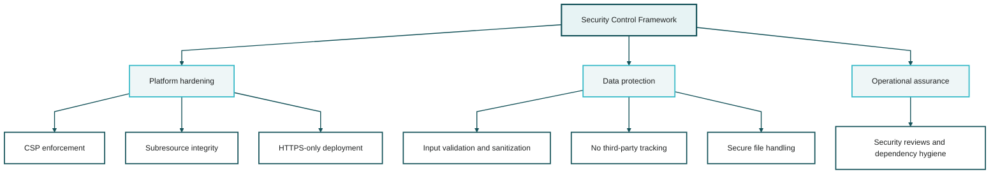

#### 4.1.1 Research Insights

- Content Security Policy should be a release gate with restrictive defaults and tightly scoped allowances for fonts, canvas behavior, and inline execution exceptions.
- Enable Trusted Types where supported to reduce DOM-based XSS exposure in a JavaScript-heavy single-page application.
- Browser storage remains script-accessible, so XSS prevention is the primary defense. Storage isolation alone is not an adequate security story for sensitive applicant data.
- If encrypted local storage remains a requirement, specify Web Crypto key management tied to a user-controlled secret and define timeout, purge, and export behavior explicitly.
- Any usage analytics or error logging must exclude document content and personally identifiable information by design.

**References:**
- MDN CSP Overview: <https://developer.mozilla.org/en-US/docs/Web/HTTP/CSP>
- MDN Trusted Types Directive: <https://developer.mozilla.org/en-US/docs/Web/HTTP/Headers/Content-Security-Policy/require-trusted-types-for>
- MDN SubtleCrypto: <https://developer.mozilla.org/en-US/docs/Web/API/SubtleCrypto>

### 4.2 Privacy Compliance

The platform adheres to Australian Privacy Principles (APPs) as outlined in the Privacy Act 1988:

**Key Privacy Measures:**
- Transparent data collection (user explicitly controls all inputs)
- Purpose limitation (data used only for clearance application)
- Data minimization (collect only necessary information)
- Storage limitation (user can clear all data at any time)
- Security safeguards (encryption, secure storage)
- User access and correction rights (full export/edit capabilities)

**Operational Privacy Control Matrix:**

| Data Class | Purpose | Default Retention | Control |
| --- | --- | --- | --- |
| Applicant workspace state | Readiness tracking and local export | Until user resets or replaces workspace | IndexedDB only, export/import supported |
| Upload metadata | Document register and quality checks | Until user removes entry or resets workspace | No silent binary retention requirement in browser-only release |
| Referee contact details | Manual briefing preparation | Until user removes referee or resets workspace | Minimize to approved contact channels and consent state |
| Disclosure draft | Applicant-authored working text | Until user edits, exports, or resets workspace | Explicit save action, local-only storage |

---

## PART V: TESTING & QUALITY ASSURANCE

### 5.1 Testing Strategy

| Test Type | Coverage |
| --- | --- |
| Unit Testing | Individual module functions, validation logic, data transformations |
| Integration Testing | Module interactions, data flow between components, storage operations |
| UI/UX Testing | User flows, form submissions, navigation, responsive design |
| Performance Testing | Page load times, animation frame rates, memory usage, large file uploads |
| Accessibility Testing | WCAG 2.2 AA compliance, keyboard navigation, screen reader compatibility, reduced-motion behavior |
| Cross-Browser Testing | Chrome, Firefox, Safari, Edge - latest 2 versions each |
| Security Testing | XSS prevention, upload-validation bypasses, stale-asset protection, secure storage validation, export/import integrity |

*Comprehensive Testing Matrix*

#### 5.1.1 Research Insights

- Raise the accessibility target from WCAG 2.1 AA to WCAG 2.2 AA so focus visibility, drag alternatives, and target-size expectations match current guidance.
- Test chart accessibility and PDF accessibility explicitly, not just the web interface. Executive visuals need text equivalents, logical reading order, and keyboard reachability where interactive.
- Add quota-exceeded, browser-restart recovery, multi-tab conflict, and stale-service-worker scenarios to the integration test suite.
- Security testing should prioritize XSS, unsafe HTML injection, upload-validation bypasses, and state corruption caused by cached or stale assets.

**References:**
- WCAG 2.2: <https://www.w3.org/TR/WCAG22/>
- WAI Complex Images Guidance: <https://www.w3.org/WAI/tutorials/images/complex/>

### 5.2 Quality Metrics

**Performance Targets:**
- Initial page load: < 2 seconds (3G connection)
- Largest Contentful Paint (LCP): <= 2.5 seconds
- Interaction to Next Paint (INP): <= 200 milliseconds
- Cumulative Layout Shift (CLS): <= 0.1
- Animation frame rate: 60fps minimum for approved progressive-enhancement scenes only

**Code Quality Standards:**
- ESLint compliance (Airbnb style guide)
- 80%+ code coverage for critical modules
- Zero console errors in production
- Accessibility conformance: WCAG 2.2 AA release gate
- Workflow metrics: export success, storage recovery success, and document-quality review completion

#### 5.2.1 Research Insights

- Use Core Web Vitals rather than `TTI` as the primary executive performance KPIs: `LCP <= 2.5s`, `INP <= 200ms`, and `CLS <= 0.1` at the 75th percentile.
- Keep animation smoothness separate from interaction responsiveness. A 60fps scene does not compensate for slow form input, upload latency, or blocking chart updates.
- Add workflow-quality metrics that reflect the product's actual purpose: unreadable upload rate, export completion success, referee-package generation success, and storage-recovery success.
- Treat accessibility conformance as release-blocking quality, not a best-effort reporting metric.

**References:**
- web.dev Largest Contentful Paint: <https://web.dev/articles/lcp>
- web.dev Interaction to Next Paint: <https://web.dev/articles/inp>
- web.dev Cumulative Layout Shift: <https://web.dev/articles/cls>

---

## PART VI: USER JOURNEY & WORKFLOW

### 6.1 Primary User Flow

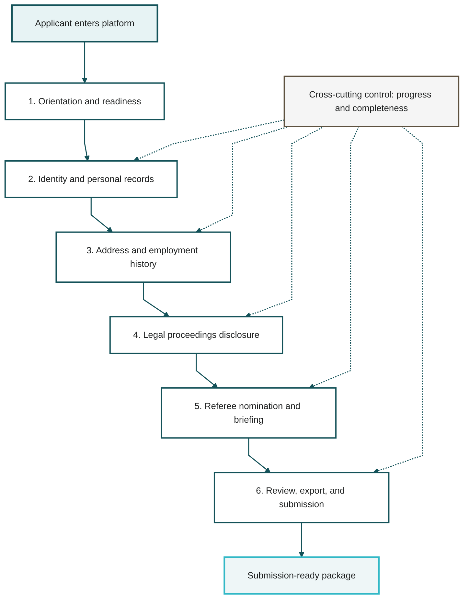

#### 6.1.1 Research Insights

- The main journey needs explicit exception paths for unreadable documents, quota exceeded, interrupted sessions, referee decline or non-response, and expired referee links.
- Provide "not applicable" and "not within the last 12 months" branches for referee and disclosure cases instead of forcing all users through a perfectly linear sequence.
- Multi-tab editing should either warn about last-write-wins behavior or protect critical sections from silent overwrite.
- The review step should include a referee-package preview, a final evidence checklist, and a visible purge/export action before submission preparation.
- Timeline messaging should remain business-day aware throughout the journey so reminders and escalation states do not drift from AGSVA expectations.

### 6.2 Critical Path Analysis

**Must-Complete Items (Blocking):**
1. Australian citizenship proof
2. Identity documents (3 types minimum)
3. 5-year address history (complete, no gaps)
4. 5-year employment history (complete, no gaps)
5. 1 professional referee (supervisor, 3+ months)
6. Legal proceedings disclosure (if applicable)
7. Current employment proof
8. Financial information (basic level)

**Optional Enhancement Items:**
- Additional referees beyond minimum
- Comprehensive financial documentation
- Character references
- Voluntary additional context

---

## PART VII: SUCCESS METRICS & OPTIMIZATION

### 7.1 Application Success Indicators

| Metric | Target | Measurement Method |
| --- | --- | --- |
| Application Completeness | 100% | Automated checklist validation |
| Document Quality Review Completion | 100% of uploaded items reviewed or accepted | Format, size, and legibility checks |
| Referee Pack Readiness by Day 15 | >= 1 eligible referee pack prepared | Business-day tracker |
| Submission Timeliness | Day 15-18 | Timeline tracker |
| Storage Recovery Success | >= 95% | Export/import and restoration test results |
| Processing Time Visibility | Accurate separation of platform time vs AGSVA time | Business-day tracker and status copy |

*Success Metrics for Clearance Application*

#### 7.1.1 Research Insights

- `Clearance Approval 100%` is an aspirational business outcome, not a controllable product metric. It should not be treated as a delivery KPI for the platform itself.
- Stronger leading indicators are day-15 completeness rate, document rejection rate, referee turnaround within the 15-business-day window, disclosure review completion, and export success rate.
- Separate external AGSVA cycle times from platform-controlled cycle times so the plan can distinguish product effectiveness from agency processing reality.
- Track failure-recovery metrics as first-class outcomes, including storage recovery, resumed-session success, and referee rework rate.

### 7.2 Platform Usage Analytics (Privacy-Preserving)

**Tracked Metrics (No PII):**
- Feature usage frequency
- Document upload success rate
- Form completion time
- Navigation patterns
- Error rates and types
- Browser/device statistics

**Optimization Opportunities:**
- Local diagnostics for completion bottlenecks and quota pressure
- User flow optimization based on explicit recovery-path friction
- UI/UX improvements driven by accessibility and completion evidence
- Performance bottleneck identification without transmitting applicant data

---

## PART VIII: MAINTENANCE & FUTURE ENHANCEMENTS

### 8.1 Ongoing Maintenance Requirements

**Regular Updates:**
- AGSVA requirement changes monitoring
- Security patch application
- Browser compatibility updates
- Library dependency updates (quarterly)
- Content accuracy verification (semi-annual)

**Support Infrastructure:**
- User feedback mechanism
- Bug reporting system
- Feature request tracking
- Documentation updates

### 8.2 Future Enhancement Roadmap

**Phase 2 Features (Post-Launch):**

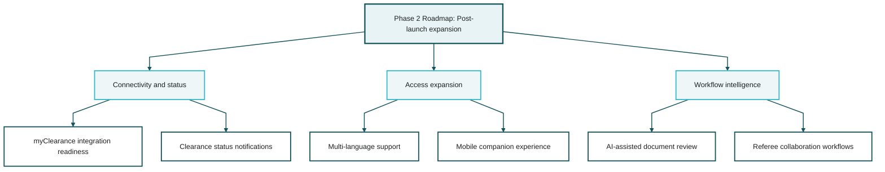

**Phase 3 Features (Advanced):**

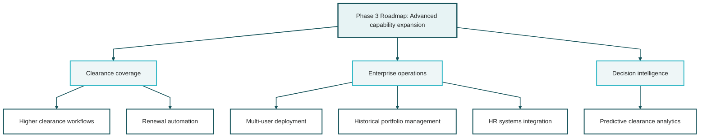

#### 8.2.1 Research Insights

- Treat `myClearance` integration as discovery-gated until an official/public API surface and an approved authentication model are confirmed.
- Prioritize post-launch improvements that directly strengthen Baseline application quality, such as recovery flows, document-quality checks, and accessibility hardening, before mobile delivery or predictive analytics.
- Higher-clearance support, organizational deployment, and HR-system integration introduce materially different privacy, assurance, and governance requirements. They should be framed as separate future programs, not simple backlog extensions.
- AI document analysis should remain human-review assistive unless accuracy thresholds, privacy controls, and evidence-retention obligations are formally defined.

---

## CONCLUSION & EXECUTIVE RECOMMENDATION

### Strategic Value Proposition

This comprehensive platform represents a transformative approach to security clearance applications, elevating the process from administrative burden to strategic advantage. By combining:

- **Fortune 500 visual standards** that communicate professionalism and attention to detail
- **Disciplined guidance systems** that improve completeness, factual consistency, and reviewer readiness
- **Automated workflow management** that ensures completeness and timeliness
- **Executive-grade documentation** that prepares referees without oversharing applicant data

The platform delivers measurable competitive advantage in securing baseline security clearance for ATO employment.

### Implementation Recommendation

**Immediate Priority:** Phase 1-3 development (foundation, core features, visualizations) - 12-16 days

**High Priority:** Phase 4-5 development (referee system, disclosure drafting support) - 5-7 days

**Quality Assurance:** Phase 6 (polish, optimization) - 3-4 days

**Total Timeline:** 20-27 days to MVP plus a separate hardening release for recovery, accessibility, and security closure

### Expected Outcomes

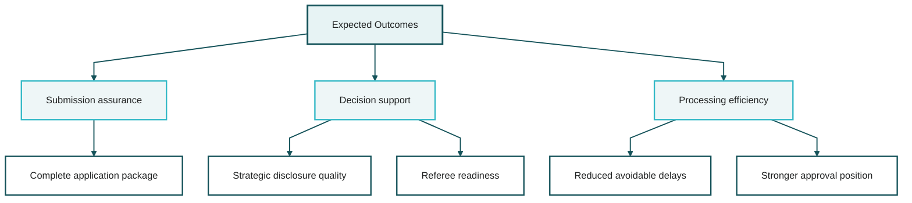

### Risk Mitigation

The platform directly addresses key clearance denial risks:

- **Incomplete information:** Automated verification prevents submission gaps
- **Referee unavailability:** Professional briefings + early engagement maximize response rate
- **Mischaracterized legal matters:** Strategic disclosure advisor provides optimal framing
- **Missing documentation:** Comprehensive checklist + upload tracking ensures completeness
- **Processing delays:** Timely submission + referee responsiveness minimize timeline extension

### Final Recommendation

Proceed with immediate development. The investment in this platform yields:
- Professional differentiation in competitive ATO selection process
- Stronger application readiness and lower avoidable rework risk
- Reusable infrastructure for future clearance renewals (15-year cycle)
- Potential template for organizational deployment

The sophisticated presentation quality, intelligent guidance systems, and comprehensive workflow management position this platform as best-in-class for security clearance applications, meeting and exceeding Fortune 500 C-suite information presentation standards.

---

## APPENDICES

### Appendix A: Technology Stack Summary

**Core Technologies:**
- HTML5, CSS3, JavaScript ES6+
- Three.js (3D visualization)
- D3.js (data visualization)
- Chart.js (statistical charts)
- GSAP (animations)
- jsPDF + html2canvas (PDF generation)

**Development Tools:**
- VS Code / Cursor AI Editor
- Git version control
- ESLint (code quality)
- Lighthouse (performance auditing)
- Chrome DevTools (debugging)

### Appendix B: AGSVA Requirements Quick Reference

**Baseline Clearance Minimum Requirements:**
- Australian citizenship (verified)
- 5-year checkable background
- 1 professional referee (supervisor, 3+ months)
- Identity documents (3 types)
- Employment history (5 years)
- Address history (5 years)
- Financial information (basic)
- Legal proceedings disclosure (if applicable)

**Processing Timeline:**
- Applicant completes application: 20 business days
- AGSVA assesses completeness: 10 business days
- AGSVA completes vetting: 20 business days
- **Total: ~50 business days (~10 weeks)**

### Appendix C: Referee Briefing Content Checklist

- [ ] Professional cover page with security marking
- [ ] Table of contents
- [ ] Executive summary (context and purpose)
- [ ] Applicant professional profile
- [ ] Professional context (ATO role, clearance requirements)
- [ ] Referee role and guidelines
- [ ] Expected questions and topics
- [ ] Character reference template
- [ ] AGSVA contact information
- [ ] Resources and support links
- [ ] Professional footer on all pages
- [ ] Page numbering and document metadata

### Appendix D: Disclosure Strategy Framework

**Full Transparency + Context Approach:**
1. Acknowledge legal proceedings openly (demonstrates integrity)
2. Characterize as administrative/procedural matter (accurate framing)
3. Highlight systemic failures (LEAP database, "Zombie Flags")
4. Emphasize professional standing (20-year unblemished career)
5. Document proactive legal defense (responsibility demonstration)
6. Provide exculpatory evidence availability (transparency)
7. Maintain cooperation posture (trustworthiness signal)

**Key Principle:** Honesty with strategic contextualization maximizes trustworthiness assessment while preventing mischaracterization.

### Appendix E: Document Validation Rules

**File Type Acceptance:**
- Birth certificates: PDF, JPEG, PNG
- Passports: PDF, JPEG, PNG
- Licenses: PDF, JPEG, PNG
- Financial documents: PDF
- Employment records: PDF

**Quality Requirements:**
- Resolution: Minimum 300 DPI for scanned documents
- File size: Maximum 10MB per file
- Readability: All text must be clearly legible
- Completeness: Full document pages (no cropping)
- Format: Professional quality scans (no photos of screens)

### Appendix F: Contact Information

**AGSVA Official Contacts:**
- Phone: 1800 640 450
- Email: securityclearances@defence.gov.au
- Website: www.agsva.gov.au
- Portal: myClearance (online system, discovery-gated for any future integration)

**Platform Support:**
- Technical issues: Internal support contact to be defined before release
- Feature requests: Internal backlog channel to be defined before release
- Documentation: Local project repository documentation

---

**Document Classification:** UNCLASSIFIED  
**Document Owner:** Vikram Deshpande  
**Last Updated:** March 12, 2026  
**Version:** 1.0  
**Next Review:** Upon implementation completion  

---

**END OF DOCUMENT**
